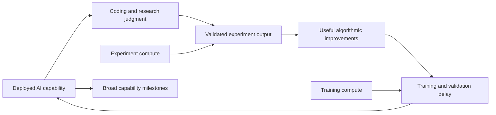

**RSI adjustment and a proposed model of takeoff to superintelligence**

September 6, 2026. Research basis: AI Futures’ August 16 update, its model explanation and changelog, and this repository’s current implementation. This is a proposal; the takeoff simulator has not been implemented.

The largest difference is the event being forecast. Our RSI tab mixes dates when proxies cross chosen thresholds. It does not require coding, research direction, experiments, and successor training to work together. I recommend keeping that useful precursor forecast and adding a separate model that explicitly simulates those dependencies.

**The new subjective adjustment**

Under “Set your own weights,” “All-things-considered penalty (%)” defaults to 0 (off). A setting of 50 turns a 10% probability by a particular date into approximately 5% by that same date. Thus, if the model says 10% within five months, this setting implements the requested judgment. Sampling introduces small rounding differences.

The transformation is F_adjusted(t) = F_model(t)^k, where k = log(0.1 × (1 − penalty/100)) / log(0.1). At 50, k ≈ 1.301; 50% becomes about 41%, and 90% becomes about 87%. It is intentionally a stronger relative discount to the early tail, not a uniform halving of every probability. The adjustment preserves eventual arrival and the sampled date range; it cannot express permanent failure or dates beyond that range. Those would require a different control.

It is applied after milestone weighting and the existing reality check. The median, interval, and main curve use the same adjusted sample. A dashed comparison shows the model before the subjective adjustment; the dotted curve still shows the model before conditioning on no crossing. Individual proxy cards retain their original meaning. This is a judgment overlay, not evidence that proxy crossings have been calibrated to RSI.

**Why AI Futures often gives later dates**

First, use the current version and identify the forecaster. The August changelog gives model medians for Automated Coder (AC) of December 2027 for Daniel and March 2029 for Eli. These are coding-automation dates, not RSI or ASI dates, and not their all-things-considered distributions. Their older December 2025 forecasts should not be used as the current comparison. [AI Futures changelog](https://www.aifuturesmodel.com/about).

AI Futures separates coding automation, research taste, and subsequent self-improvement. Its SAR milestone means full AI R&D automation; ASI additionally demands broad superiority beyond AI research. Compute bottlenecks and diminishing research returns can prevent a rapid explosion even after automation. Research-only capability does not automatically establish general superintelligence. [Model architecture and milestone definitions](https://blog.aifutures.org/p/ai-futures-model-dec-2025-update).

| Our implementation | Implication for the comparison |
|---|---|
| METR thresholds are 174 hours at 50% and 80% success | These are finite task-horizon thresholds, not direct demonstrations of replacing an entire engineering workforce. |
| Staff acceleration reaches 10× | Assistance at this level can remain dependent on human researchers. |
| CoBench reaches 85%; next-step judgment reaches 90% | These are separate mixture components. A fast CoBench draw is not held back by a slow judgment draw. |
| Code output reaches 30× | More merged code is not the same quantity as more useful research or faster successor improvements. |
| Revenue reaches $1T; ECI reaches 187.5 or 200 | Commercial or benchmark thresholds can be reached without closing an autonomous research loop. |
| The default clock moves release-dated evidence back by 30–60 days | Clock alignment matters when comparing near-term probabilities. |

Sources for our side: `_PC_RSI_WEIGHTS`, `_pc_render_milestones`, `_pc_rsi_blend_samples`, and `_pc_report_lag` in [visualize_projection.py](visualize_projection.py). The existing [one-year memo](RSI_ONE_YEAR_MEMO.md) records a dated snapshot of the proxy distributions; its percentages are not an independent RSI calibration.

For its horizon anchor, AI Futures’ displayed default AC requirement is 130 work-years. It also models imperfect parallelization and complementarity between coding labor and experiment compute. That threshold is vastly more demanding than our 174 hours, but copying it into our exponential extrapolation would be inappropriate: their horizon curve is superexponential and the anchor is only one forecasting method. [AI Futures model explanation, §§6.2–6.3](https://www.timelinesmodel.com/).

The August update’s simplified uplift example starts at 2×, doubles uplift minus one every five months, and targets 20× for AC (32× in the full model’s median case). It also explicitly models training delays and discusses subjective adjustments for model errors and data bottlenecks. Forecasts assume development proceeds as fast as technically feasible. [August update](https://blog.aifutures.org/p/q25-2026-timelines-update-uplift).

A useful calculation isolates the threshold effect. Under that simplified exponential rule, moving the target from 10× to 20× adds 5 × log2(19/9) ≈ 5.4 months; moving it to 32× adds about 8.9 months. Starting at 2× rather than 4× adds another 5 × log2(3) ≈ 7.9 months, holding everything else fixed. These are my counterfactual calculations, not an attribution of how many months each assumption contributes to their full simulation. Our staff trend also uses a different fit, so these are sensitivity illustrations rather than reproduced dashboard results.

My interpretation: the main sources of earlier dates here are weaker operational thresholds and treating proxies as alternative answers instead of modeling necessary capabilities together. Short, rapidly improving series and fixed thresholds add uncertainty about extrapolation. The 90-day reality check addresses visibility near today; it does not address the missing transition from benchmark performance to sustained research feedback. A 50-point subjective penalty is reasonable as an explicit personal judgment, but the comparison alone does not establish that it is the correct calibration.

I could read the published explanation and updates, but direct forecast pages returned a loading shell. I have not reproduced their Monte Carlo forecasts or quantified a full decomposition of the date difference. In particular, there is no verified apples-to-apples comparison of their “RSI in five months” probability with ours.

**Proposed takeoff model**

Build a “Takeoff” tab with explicit milestones: consequential AI R&D feedback, full R&D automation, superhuman AI research, and broad ASI. Define consequential feedback operationally as useful successor improvements that measurably raise research productivity across at least two completed development cycles. The persistence requirement is a proposed modeling convention and should be visible and adjustable.

Use a small, inspectable simulator with weekly steps and shared Monte Carlo draws. Each draw tracks coding capacity, research judgment, experiment compute, accumulated algorithmic improvements, and the capability of the currently deployed model. A release/train-completion date pair distinguishes an internal technical milestone from public availability.

Suggested first implementation:

1. **Separate coding from judgment.** Calibrate coding using METR, CoBench, and measured uplift. Treat next-step judgment as noisy evidence about research direction, with uncertainty about transfer to autonomous work. Share latent trend draws across correlated indicators rather than treating them as independent confirmations.
2. **Bound experiment throughput.** Begin with a weighted harmonic mean of normalized coding capacity and experiment compute. Multiply by research quality and the fraction of findings that validate and transfer. This makes a shortage of either input constraining. Expose the bottleneck strength as a sensitivity setting.
3. **Accumulate useful improvements.** Use d log(S)/dt = a × R(t)^α / S(t)^β, where R is validated research output, S is algorithmic efficiency, α captures returns to research effort, and β captures increasing difficulty. Calibrate a to observed progress at the starting date. Coding and judgment depend on the deployed model, so improvements feed back only after incorporation into a successor.
4. **Represent training explicitly.** Queue improvements into training runs with sampled training, evaluation, and deployment durations. Improvements discovered during a run become available in a subsequent run unless an explicit online-update mechanism is enabled. Allocate compute across experiments, training, and inference; the same capacity cannot be spent three times.
5. **Model broad ASI separately.** Sample uncertain gaps from research capability to top-expert performance in other cognitive domains, followed by a further superiority gap. Report sensitivity to these assumptions prominently; no defensible ECI-to-ASI conversion is established here.
6. **Preserve stalled outcomes.** Retain trajectories that plateau or miss the horizon. Show their probability and report “beyond horizon” when a quantile is not reached. Do not silently condition charts on successful takeoffs.

The new subjective slider belongs to the precursor forecast. For an initial bridge, its distribution can supply a start-date scenario, with an explicit sampled gap to full automation. In the eventual integrated model, infer both onset and takeoff from common latent capability states; do not independently sample the proxy blend and add it to a second automation forecast. That would double-count time and lose correlations.

Likewise, calibrate baseline research growth to today's already AI-assisted progress. Multiplying that observed trend by the entire current AI uplift would count existing assistance twice. Additional acceleration should be relative to the starting level.

Use existing data-center trajectories for a baseline compute scenario, accounting for the share a lab can actually allocate. Add hardware R&D and manufacturing feedback as a later extension with physical lead times. Revenue should initially be a funding constraint or cross-check rather than a direct ASI trigger.

**Reviewable delivery sequence**

The first increment should be a conditional takeoff scenario explorer: user-specified automation onset plus research/compute/training dynamics. Display ASI arrival CDFs, onset-to-ASI intervals, probability of takeoff within 6/12/24 months, and which bottleneck dominates. Label initial parameter ranges as elicited scenarios until calibrated. Offer fast, central, and bottlenecked scenarios without implying those three cases have established probabilities.

The second increment should fit a joint onset model using the repository’s indicators. Compare matched events and clocks with AI Futures, then change one assumption at a time using the same draws: thresholds, current uplift, trend rates, research transfer, compute, and cycle delays. This is how to measure the contributions to the disagreement rather than infer them from headline medians.

Before treating outputs as forecasts, require recovery of the calibrated present-day trend, no feedback with zero transfer, monotonic delays when training takes longer, compute budget conservation, retained non-arrival mass, and convergence when weekly steps are halved. Backtest against held-out observed uplift and capability data. Freeze dated parameter snapshots and seeds so users can distinguish new evidence from random rerun variation.
